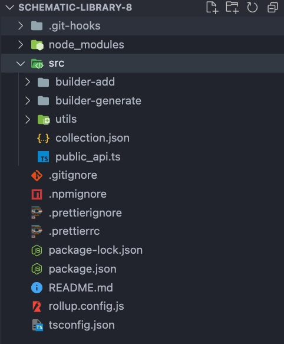

## Introduction

When you start a new Schematic Project you will face something like this:



- Inside `src` you will have a file named: `collection.json`. This files is the most important files because it has all the information about schematics. If you don't declare here you won't use it.
- Two folders named: `builder-add` and `builder-generate`. `builder-add` is an special schematics that will execute when you install into your project with `builder add [collection-name]` and `builder-generate` contains all the schematics.

## Importand files
### collection.json

This JSON file encapsulates details about all schematics within your project, dictating the declaration for each schematic. It's what the CLI references upon using your library. Each schematic in the collection must define several properties, as shown in the example below.

| Property    | Type             | Optional | Default |
| ----------- | ---------------- | -------- | ------- |
| Description | string           | true     |         |
| Factory     | string           | true     |         |
| Schema      | string           | false    |         |
| Hidden      | boolean          | false    | false   |
| Extends     | string           | false    |         |
| Private     | Boolean          | false    | false   |
| aliases     | array of strings | false    |         |

We can see an example of a collection:

```json
{
  "$schema": "../node_modules/@angular-devkit/schematics/collection-schema.json",
  "schematics": {
    "builder-add": {
      "description": "Add the library to the project",
      "factory": "./builder-add/builder-add.factory",
      "schema": "./builder-add/schema.json"
    },
    "scan": {
      "description": "Scan project and represent into a json file",
      "factory": "./builder-generate/scan-project/scan.factory#scan",
      "aliases": [
        "s"
      ]
    },
    "build": {
      "description": "Execute all the schematics with the json file",
      "factory": "./builder-generate/build/build.factory#executeWorkspaceSchematics",
      "aliases": [
        "b"
      ]
    },
    "checkPackages": {
      "description": "Check collections",
      "factory": "./builder-generate/check-packages/check-packages.factory#checkPackages",
      "hidden": true
    },
    "checkProjects": {
      "description": "Check collections",
      "factory": "./builder-generate/check-projects/check-projects.factory#checkProjects",
      "hidden": true
    },
    "uninstallPackages": {
      "description": "Uninstall collections",
      "factory": "./builder-generate/uninstall-packages/uninstall-packages.factory#uninstallPackages",
      "hidden": true
    },
    "AddCollectionsAngularJson": {
      "description": "Add collections to angular.json",
      "factory": "./builder-generate/add-collections-angular-json/add-collections-angular-json.factory#AddCollectionsAngularJson",
      "hidden": true
    }
  }
}
```

### schema.json
This file outlines the prompts presented to users before the factory initiates, dictating the interaction flow.

### factory file
The name of this file refers to a specific factory and must be consistently referenced in the collection.json for each schematic.