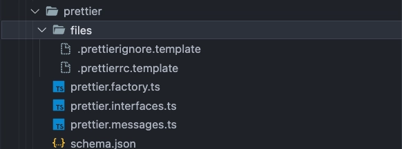

When you are adding files you will need three different things:

1. The files names.
2. Where are these files in your schematic project base on the factory function.
3. Which variables do you need to send to the files?

There is how a schematic with files looks like:


If you noticed, every files has the `.template` extension, that is because you will have templating code the will to create files with dynamic code. This code that will be dynamic with the original extension will throw errors.

## Code to add files

```ts
import { Rule, strings, MergeStrategy } from "@angular-devkit/schematics";

function addPrettierFiles(): Rule {
  const urlTemplates = [".prettierrc.template", ".prettierignore.template"];
  const template = apply(url("./files"), [
    filter((path) => urlTemplates.some((urlTemplate) => path.includes(urlTemplate))),
    applyTemplates({
      ...strings,
    }),
    renameTemplateFiles(),
    move("./"),
  ]);
  return mergeWith(template, MergeStrategy.Overwrite);
}
```

As you noticed you have many elements:

| Method  | Meaning |
| ------- | ------- |
| **apply** | This will take the files and modify them |
| **filter** | Will get only the files that you need |
| **applyTemplates** | It will sent variables to the files |
| **renameTemplateFiles** | Will remove the `.template` extention |
| **move** | Will move the files from schematic project to target project |

### Templating
Inside you files you will need dynamic code, for this reason you need the next info:


Inside your
