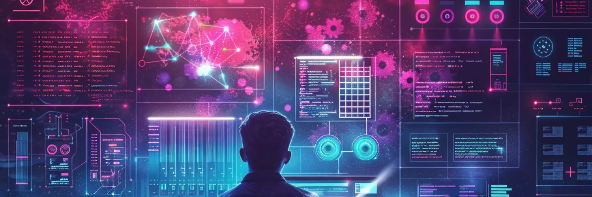

## Introduction

Imagine you have a magic wand that can instantly create, modify, or organize your project files exactly how you want them, without any mistakes. That's what schematics do for software development. They automate tasks that would usually take hours and ensure everything is done correctly every time. Here's why schematics are a game-changer:

1. **Save Time on Repetitive Tasks:**
Manual tasks like creating components, services, or setting up configurations take time and can be repetitive. Schematics can do all these tasks in seconds, letting you focus on writing the unique parts of your code.

2. **Ensure Consistency:**
When working on a project with a team, maintaining consistent coding standards and file structures is crucial. Schematics ensure that every file or feature added follows the project's guidelines, reducing the chances of errors or inconsistencies.

3. **Simplify Complex Tasks:**
Some coding tasks are complex and prone to human error, especially under tight deadlines. Schematics can automate complex setups or configurations, ensuring they are done accurately and efficiently.

4. **Customizable for Your Needs:**
Whether you're working on an Angular project or not, schematics are highly customizable. You can create your own schematics to fit the specific needs of your project, making your development process even more streamlined.

5. **Learn Once, Use Everywhere:**
Once you get the hang of using schematics, you can apply them to any JavaScript project, not just Angular. This makes schematics a valuable skill in your developer toolkit.

## In Conclusion

Schematics are like having a superpower for your development process. They make your work faster, ensure consistency across your projects, simplify complex tasks, and are adaptable to your specific needs. For anyone new to the world of development or looking to level up their productivity, learning to use schematics is a smart move.
